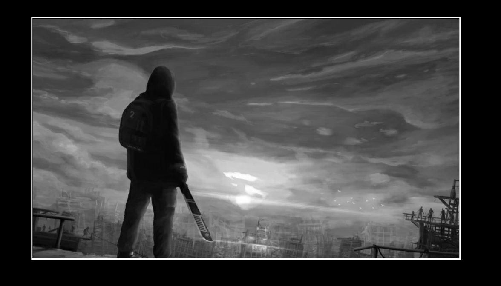

# Step1: Pixel Manipulation ->
- Here, I've learnt how to import the image file via normal and string method in canvas.
- Learnt how to manipulate colored pixels to black and white pixels.  
- The code is self-explanatory. 
### Click on the image below to get an interactive code:

- *Cheers!*